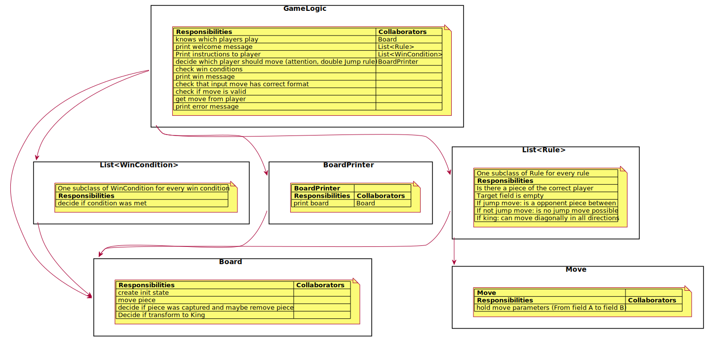

# Assignment 1

## Exercise 1

### Part 1

#### Task
Draw the structure of the project’s packages and classes.
You have to: (i) decide the level of abstraction you want to use in this
depiction, (ii) use natural language to explain your decision,
and (iii) describe what you understood from this depiction of the system

#### Diagram of the project's packages and classes

#### Why was this level of abstraction used?

#### Description of the system based on the diagram above

### Part 2

#### Task

The call graph below shows the methods called
to create a PacMan character and its 2D map.

As seen in the diagram, the Main function first calls launch.
As the name suggests, the method "launches" the game in its initial setup.
The makeGame() method is a crucial component to make a
new level(level design and map boundaries) in the game.

At the same time, we step into creating a single Player game inside the created level.
This in turn call the createPacMan() method creates new PacMan character.

#### Call graph diagram

## Exercise 2 - A Checkers Game - Design

### Part 1

#### Task
Following the Responsibility Driven Design, start from the game’s requirements and rules and derive
classes, responsibilities, and collaborations (use CRC cards). Describe each step you make and store
the final cards in your answers

#### CRC Cards

#### Description of the steps which lead to these CRC cards

### Part 2

#### Task
Following the Responsibility Driven Design, describe the main classes you designed to be your
project in terms of responsibilities and collaborations

#### Description of the main classes

### Part 3

#### Task
Why do you consider the other classes as less important? Following the Responsibility Driven De-
sign, reflect if some of those non-main classes have similar/little responsibility and could be changed,
merged, or removed

### Part 4

#### Task
Draw the class diagram of the aforementioned main elements of your game (do not forget to use
elements such as parametrized classes or association constrains, if necessary)

#### Class diagramm

### Part 5

#### Task
Draw the sequence diagram to describe how the main elements of your game interact (consider
asynchrony and constraints, if necessary)

#### Sequence diagram
